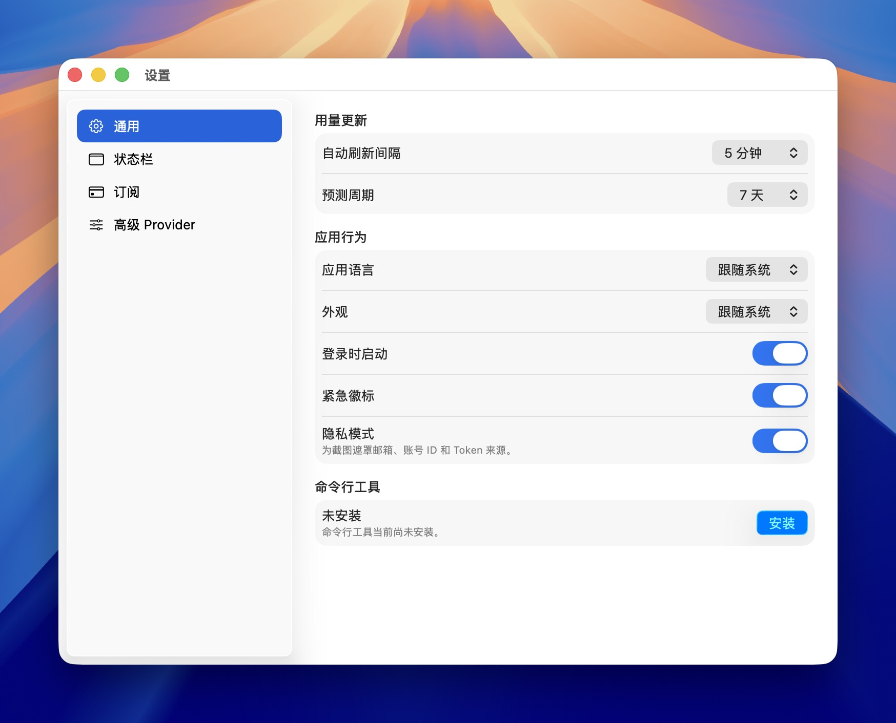
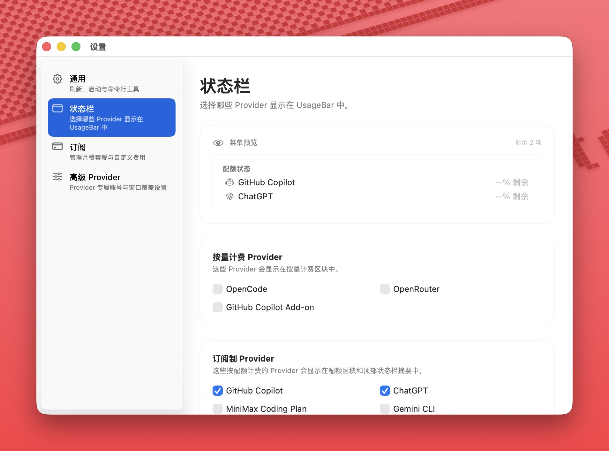
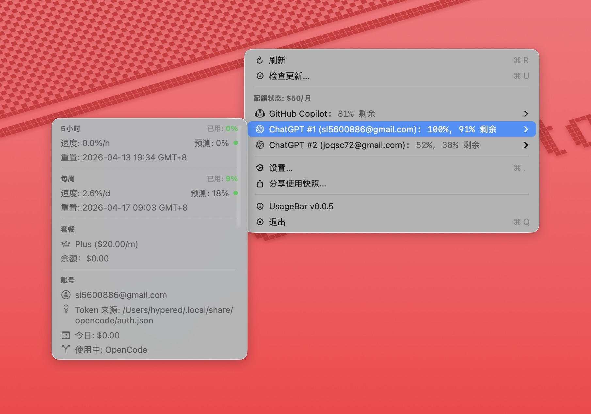

<p align="right">
  <a href="README.md">English</a> | <a href="README.zh-CN.md">中文</a>
</p>

<p align="center">
  
</p>

<p align="center">
  
  
</p>

<h1 align="center">UsageBar</h1>

<p align="center">
  <strong>在 macOS 菜单栏中一站式追踪所有 AI 订阅、配额与费用。</strong>
</p>

<p align="center">
  <a href="https://github.com/SHLE1/usage-bar/releases/latest">
    
  </a>
  <a href="https://github.com/SHLE1/usage-bar/blob/main/LICENSE">
    
  </a>
  
  
</p>

---

**UsageBar** 是一款轻量级 macOS 菜单栏应用，将 13+ AI 服务商的用量数据汇聚在一个面板中。它能自动从 [OpenCode](https://opencode.ai)、独立 CLI 工具、macOS 钥匙串、编辑器配置及浏览器 Cookie 中发现凭证——无需任何手动配置。

## 安装

### Homebrew（推荐）

```bash
brew install --cask SHLE1/tap/usage-bar
```

### 直接下载

从 [**Releases**](https://github.com/SHLE1/usage-bar/releases/latest) 页面下载最新的 `.dmg` 文件，打开后将 **UsageBar** 拖入「应用程序」文件夹即可。

UsageBar 可通过菜单中的 **Check for Updates...** 检查新版本。当前发布包未签名，安装更新后 macOS Gatekeeper 可能仍需手动允许：

```bash
xattr -cr "/Applications/UsageBar.app"
```

## 功能

### 🔍 统一看板

所有 AI 服务商集中在一个菜单栏下拉菜单中——按量付费的费用和配额制的剩余百分比一目了然。

```
─────────────────────────────
Pay-as-you-go: $37.61
  OpenRouter       $37.42    ▸
  OpenCode           $0.19   ▸
─────────────────────────────
Quota Status: $219/m
  Copilot (0%)               ▸
  Claude: 0%, 100%           ▸
  Kimi for Coding: 0%, 51%   ▸
  ChatGPT (100%)             ▸
  Gemini CLI #1 (100%)       ▸
─────────────────────────────
Predicted EOM: $451
─────────────────────────────
Refresh (⌘R)
Check for Updates... (⌘U)
Settings... (⌘,)
Share Usage Snapshot...
─────────────────────────────
UsageBar v0.2.0
Quit (⌘Q)
```

### 🔌 零配置服务商发现

UsageBar 自动查找并认证你的 AI 服务商：

- **OpenCode auth** — 主要来源（`auth.json`，支持 XDG 多路径回退）
- **独立工具** — Codex CLI、Claude Code CLI、GitHub CLI、GitHub Copilot CLI
- **macOS 钥匙串** — Claude、GitHub Copilot OAuth 令牌
- **编辑器配置** — VS Code / Cursor 的 Copilot 配置
- **浏览器 Cookie** — Chrome、Brave、Arc、Edge（仅限 GitHub Copilot）
- **OpenCode 插件** — ChatGPT、Antigravity、Gemini、Claude 的多账号支持
- **UsageBar 自管的 Codex 账号** — 手动加入当前官方 `codex` 登录，把多个 ChatGPT 账号长期保存在 UsageBar 内

多来源账号会按邮箱自动去重合并。

### 📊 13 个支持的服务商

#### 按量付费

| 服务商 | 核心指标 |
|--------|---------|
| **OpenRouter** | 积分余额、日/周/月费用 |
| **OpenCode** | 会话级费用摘要 |
| **GitHub Copilot Add-on** | 超出 Copilot 配额后的超额计费 |

#### 配额制

| 服务商 | 核心指标 |
|--------|---------|
| **GitHub Copilot** | 多账号、每日历史、超额追踪 |
| **Claude** | 5h / 7d 窗口、Sonnet / Opus 拆分 |
| **ChatGPT** | 主/副配额、套餐类型 |
| **Kimi for Coding** | 5h / 7d 窗口、会员等级 |
| **Gemini CLI** | 按模型配额、多账号（显示邮箱标签） |
| **Antigravity** | 离线缓存解析（`state.vscdb`） |
| **MiniMax Coding Plan** | 5h / 周 双窗口配额 |
| **Z.AI Coding Plan** | Token / MCP 配额、工具用量（24h） |
| **Nano-GPT** | 每周输入 Token 配额、USD / NANO 余额 |
| **Chutes AI** | 每日配额限制、积分余额 |
| **Synthetic** | 5h 用量上限、请求数限制 |

> **注意**：ChatGPT 的原始 Provider ID 为 `codex`，CLI 命令中使用此 ID（例如 `usagebar provider codex`）。

### 📈 用量预测与节奏

- **节奏指示器** — 正常、偏快或过快
- **月末预测 (EOM)** — 基于加权平均的月底费用预估
- **等待时间** — 配额耗尽时显示重置倒计时（格式：`1d 5h`、`3h` 或 `45m`）

### 💰 订阅追踪

按服务商设置订阅档位（预设或自定义月费）。`Quota Status` 标题行显示合并后的月度总费用，过期保存项可通过本地化确认弹窗清除。

### ⚙️ 设置

| 选项卡 | 内容 |
|--------|------|
| **General（通用）** | 自动刷新周期（1 分钟 – 1 小时）、预测周期（7 / 14 / 21 天）、应用语言（跟随系统 / EN / 中文）、登录时启动、紧急徽章、用于截图遮罩账号信息的隐私模式、CLI 安装、偏原生的主操作按钮 |
| **Status Bar（状态栏）** | 更轻的原生 macOS 预览分组、可拖拽服务商排序、按服务商显示开关、贴边的 Provider 卡片、关闭后移动到关闭分组首位以减少跳动、精简后的配额型状态栏说明、预览/菜单顺序跟随状态栏服务商列表、Copilot Add-on 开关 |
| **Advanced Providers（高级 Provider）** | ChatGPT：把当前 `codex` 登录保存到 UsageBar（Keychain 存储）、删除已保存账号、账号选择、状态栏窗口模式（5h / weekly / 同时） |
| **Subscriptions（订阅）** | 使用原生 macOS 菜单选择器为配额制服务商设置预设套餐或自定义月费，支持本地化过期设置清理确认，使用更偏原生的 Apply 按钮样式，并显示各 Provider 图标以便快速识别 |

### 🖥️ 多服务商状态栏

macOS 状态栏可以紧凑地展示多个配额制服务商的图标和剩余百分比。通过 **设置 > 状态栏** 配置显示哪些服务商。选中的服务商遇到临时获取错误时，图标会继续显示，并在菜单中显示错误详情。

### ⬇️ App 内更新

通过菜单中的 **Check for Updates...** 可使用 Sparkle 从 GitHub Releases 下载新版本。在 UsageBar 拥有 Apple Developer 证书之前，下载的更新包仍是未签名版本，可能需要执行上方的 Gatekeeper 命令。

### ⌨️ CLI 命令行工具

内置命令行工具，用于脚本集成和自动化：

```bash
usagebar status              # 所有服务商（表格）
usagebar status --json       # 所有服务商（JSON）
usagebar list                # 列出已配置的服务商
usagebar provider claude     # 指定服务商的详细信息
```

<details>
<summary>表格输出示例</summary>

```
$ usagebar status
Provider              Type             Usage       Key Metrics
─────────────────────────────────────────────────────────────────────────────────
Claude                Quota-based      77%         23/100 remaining
ChatGPT               Quota-based      0%          100/100 remaining
Copilot (user1)       Quota-based      45%         550/1000 remaining
Copilot (user2)       Quota-based      12%         880/1000 remaining
Gemini CLI (user@gmail.com)  Quota-based  0%       100% remaining
Kimi for Coding       Quota-based      26%         74/100 remaining
MiniMax Coding Plan   Quota-based      0%, 0%      100/100 remaining
OpenCode              Pay-as-you-go    -           $0.19 spent
OpenRouter            Pay-as-you-go    -           $37.42 spent
```

</details>

<details>
<summary>JSON 输出示例</summary>

```json
{
  "claude": {
    "type": "quota-based",
    "remaining": 23,
    "entitlement": 100,
    "usagePercentage": 77,
    "overagePermitted": false
  },
  "copilot": {
    "type": "quota-based",
    "remaining": 1430,
    "entitlement": 2000,
    "usagePercentage": 28,
    "overagePermitted": true,
    "accounts": [
      {
        "index": 0,
        "login": "user1",
        "authSource": "opencode",
        "remaining": 550,
        "entitlement": 1000,
        "usagePercentage": 45,
        "overagePermitted": true
      }
    ]
  },
  "openrouter": {
    "type": "pay-as-you-go",
    "cost": 37.42
  }
}
```

</details>

**退出码**：`0` 成功 · `1` 通用错误 · `2` 认证失败 · `3` 网络错误 · `4` 无效参数

从 **设置 > 通用 > 命令行工具** 安装 CLI，或手动运行 `bash scripts/install-cli.sh`。

## 工作原理

1. **令牌发现** — 从 OpenCode `auth.json`（XDG 多路径）、钥匙串、编辑器配置、浏览器 Cookie 及插件元数据中读取认证令牌
2. **账号去重** — 通过稳定的邮箱优先策略合并多来源账号
3. **并发获取** — 通过 Swift `TaskGroup` 同时查询所有服务商 API，支持可配置超时（默认 30 秒）
4. **智能缓存** — 网络错误时回退到缓存数据；每日历史采用混合缓存策略（近期获取新数据，较早日期使用缓存）
5. **优雅降级** — 部分服务商失败时仍显示可用的服务商；多账号服务商支持部分成功

## 隐私与安全

- **100% 本地运行** — 数据不离开你的设备，无任何第三方分析
- **只读访问** — 仅使用现有令牌，不请求额外权限
- **直连 API** — 直接与服务商 API 通信，无中间层
- **浏览器 Cookie** — GitHub Copilot 可选读取会话 Cookie（只读，不存储密码）

## 常见问题

<details>
<summary>"No providers found"（未找到服务商）</summary>

确认 OpenCode 已安装并完成认证。应用按以下顺序查找 `auth.json`：

1. `$XDG_DATA_HOME/opencode/auth.json`（若 `XDG_DATA_HOME` 已设置）
2. `~/.local/share/opencode/auth.json`（默认路径）
3. `~/Library/Application Support/opencode/auth.json`（macOS 后备路径）

对于 ChatGPT 账号发现，应用按以下优先级顺序搜索：
1. **UsageBar Codex Accounts** — 通过 **Settings → Advanced Providers → Codex → Save Current Login** 手动保存的账号
2. OpenCode auth — `auth.json` 中的 `openai` Provider 条目
3. OpenCode multi-auth — `~/.opencode/auth/openai.json`
4. OpenCode 旧版 — `~/.opencode/openai-codex-accounts.json` 和 `~/.opencode/projects/*/openai-codex-accounts.json`
5. `codex-lb` — `~/.codex-lb/store.db` 与 `~/.codex-lb/encryption.key`
6. 官方 Codex 登录 — `~/.codex/auth.json`

如需在 UsageBar 中长期保留多个 ChatGPT 账号，先用官方 `codex` CLI 登录，再到 **Settings → Advanced Providers → Codex** 手动加入当前账号。UsageBar 会在本地保存并续期这些账号，不会改动 `~/.codex/auth.json`。

</details>

<details>
<summary>GitHub Copilot 未显示</summary>

Copilot 账号按以下优先级从多个来源发现：

1. **OpenCode auth** — `auth.json` 中的 `copilot` 条目
2. **Copilot CLI 钥匙串** — macOS 钥匙串中的 `copilot-cli` 条目
3. **GitHub CLI 钥匙串** — macOS 钥匙串中的 `gh:github.com` 条目
4. **VS Code / Cursor** — `~/.config/github-copilot/hosts.json` 和 `apps.json`
5. **浏览器 Cookie** — Chrome、Brave、Arc、Edge 的会话 Cookie

登录名相同的账号自动合并。运行 `usagebar provider copilot` 可验证已检测到的来源。

</details>

<details>
<summary>找不到 OpenCode 二进制文件</summary>

应用通过多种策略动态查找 `opencode` 二进制文件：

1. 当前 PATH（`which opencode`）
2. 登录 Shell 的 PATH
3. 常见安装路径：`~/.opencode/bin/opencode`、Homebrew 路径、`/usr/local/bin/opencode`

</details>

## 开发

### 环境要求

- macOS 13.0+
- Xcode 15.0+

### 初始化

```bash
git clone https://github.com/SHLE1/usage-bar.git
cd usage-bar
make setup    # 配置 Git 钩子（SwiftLint + action-validator）
```

### 构建与运行

```bash
# 构建
xcodebuild -project UsageBar/UsageBar.xcodeproj \
  -scheme UsageBar -configuration Debug build

# 运行（自动检测构建路径）
open "$(xcodebuild -project UsageBar/UsageBar.xcodeproj \
  -scheme UsageBar -configuration Debug -showBuildSettings 2>/dev/null \
  | sed -n 's/^[[:space:]]*BUILT_PRODUCTS_DIR = //p' | head -n 1)/UsageBar.app"
```

也可使用 VS Code 任务 **"Debug: Kill + Build + Run"** 一键完成。

### 代码检查

```bash
make lint            # 运行所有 Linter
make lint-swift      # 仅 SwiftLint
make lint-actions    # 仅 GitHub Actions YAML 验证
```

## 贡献

欢迎提交 Pull Request！

1. Fork 本项目
2. 创建功能分支（`git checkout -b feature/amazing-feature`）
3. 运行 `make setup`（克隆后首次执行）
4. 完成修改并提交——预提交钩子会自动运行
5. 推送并创建 Pull Request

## 许可证

MIT License — 详见 [LICENSE](LICENSE) 文件。

## 致谢

- [opgginc/opencode-bar](https://github.com/opgginc/opencode-bar)
- [ndycode/codex-multi-auth](https://github.com/ndycode/codex-multi-auth)
- [anomalyco/opencode](https://github.com/anomalyco/opencode)
- [Sparkle](https://sparkle-project.org)

---

<p align="center">
  Built for AI power users who keep one eye on usage
</p>
